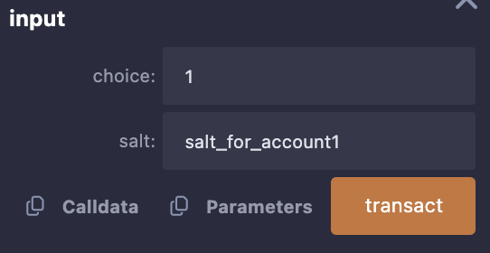
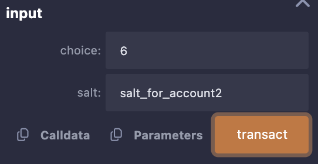
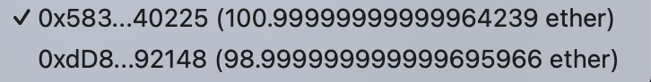
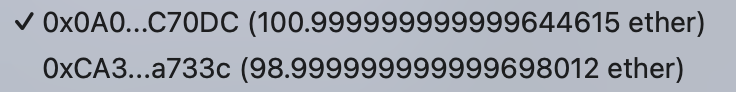
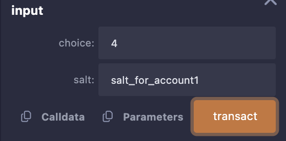
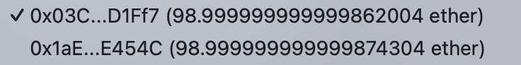

# วิธีการเล่นเบื้องต้น 🎮
1. ใช้ 2 account ในการเล่น โดยให้ `account1` และ `account2` เรียกใช้ฟังก์ชัน `addPlayer()` โดยวางเงินคนละ `1 ether` เพื่อเข้าร่วมเกม
2. ให้ แต่ละ `account` เรียกใช้ฟังก์ชัน `input()` เพื่อทำการเป่ายิ้งชุ้บ โดยต้องใส่ parameter 2 อย่างคือ 
    - `choice` ค่าที่ต้องการจะออกโดยที่สามารถเลือกค่าได้ตาม [นี้](#5-ปัญหา-เกมซับซ้อนมากยิ่งขึ้น)
    - `salt` ค่า random เพื่อทำให้ hash เปลี่ยนไป
3. เมื่อข้อ 2 เสร็จสิ้นให้รียกใช้ฟังก์ชัน `revealChoice()` เพื่อเป็นการประกาศ ค่า `choice` ที่ตนเองเลือก โดยใส่ parameter 2 ค่า ดังนี้
    - choice
    - salt
4. โดยเมื่อ ทำการ `revealChoice` เสร็จสิ้นทั้งสองผู้เล่น ระบบจะตรวจสอบว่าผู้เล่นใดเป็นผู้ชนะ และมอบ `reward` ให้ผู้เล่นที่เป็นฝ่ายชนะ

5. กรณีผู้เล่นต้องการถอนเงินคืน สามารถเรียกใช้ฟังก์ชัน `withdraw()` เพื่อถอนเงินคืนได้ โดยต้องเป็นไปตาม [เงื่อนไข](#2-ปัญหา-ล็อคเงิน)
## 1. ปัญหา: Front Running
แก้ไขโดยใช้ commit reveal โดยเมื่อผู้เล่นเรียกใช้ฟังก์ชัน `input()` จะทำการ commit `choice` ที่ตนเลือก จากนั้นเมื่อ commit ครบทั้งสองผู้เล่นแล้ว ให้แต่ละผู้เล่นทำการ reveal ผ่านฟังก์ชัน `revealChoice()` เพื่อแจ้งค่า `choice` ที่ตนเลือก

## 2. ปัญหา: ล็อคเงิน
แก้ไขผ่านฟังก์ชัน `withdraw()` ซึ่งจะสามารถคืนเงินได้ ภายใน 3 เงื่อนไข ดังนี้
- มีคนลงขันแค่คนเดียว
- มีคนลงขัน 2 คน แต่มีคน commit แค่คนเดียว
- มีคนลงขัน 2 คน มีคน commit 2 คน แต่ยอม reveal แค่คนเดียว

โดยจะทำการคืน `reward` ทั้งหมดให้ผู้ที่ไม่ผิดกติกาเพียงผู้เดียว

## 3. ปัญหา: ยากต่อการจะรู้ว่า account ใดเป็น `idx` เป็น 0 หรือ 1

ทำการสร้างตัวแปร `addressToPlayer` ซึ่งเป็นตัวแปรประเภท `mapping (address => uint)` ทำให้เราสามารถเข้าถึง `idx` ของ `player` ได้โดยตรง ส่งผลให้เราไม่จำเป็นต้องใส่ค่า `idx` ในการเรียกฟังก์ชัน `input()`

## 4. ปัญหา: Contract เล่นได้แค่รอบเดียว
แก้ไขโดยใช้ฟังก์ชัน `_restartGame()` ซึ่งจะทำการรีเซ็ตค่าทุกอย่างเพื่อให้สามารถเริ่มเกมใหม่อีกครั้งโดยที่ไม่ต้อง Deploy Contract ใหม่

## 5. ปัญหา: เกมซับซ้อนมากยิ่งขึ้น
แก้ไขโดยให้ `choice` มีค่าได้ถึง 0 - 7 โดยที่ 
- 0 - Rock 🪨
- 1 - Water 💧
- 2 - Air 🌬️
- 3 - Paper 📃
- 4 - Sponge 🧽
- 5 - Scissors ✂️
- 6 - Fire 🔥
- 7 - Undefined ❌

# การแสดงผลการทดสอบ 🧪

## 1. กรณีมีผู้แพ้ชนะ 🏆
1. เริ่มต้น ทั้งสอง `Account` มียอดเงินเท่ากับ `100 Ether`

2. `Account` ทั้งสอง ทำการลงขันด้วย `1 Ether` -> เหลือประมาน `98.999 Ether`

3. `Account` ทั้งสองทำการเป้ายิ้งชุ้บ ดังนี้
    - `Account1` ทำการออก `choice = 1 (Water)`💧 พร้อมกับใส่ `salt = "salt_for_account1"` 

    - `Account2` ทำการออก `Fire (choice=6)` พร้อมกับใส่ `salt = "salt_for_account2"` 🔥

4. `Account1` ชนะ `Account2` เนื่องจาก `น้ำ`💧 ชนะ `ไฟ`🔥 ดังนั้น `Account1` จะได้ reward 

## 2. กรณีเสมอ 🟰
1. เริ่มต้น ทั้งสอง `Account` มียอดเงินเท่ากับ `100 Ether`

2. `Account` ทั้งสอง ทำการลงขันด้วย `1 Ether` -> เหลือประมาน `99 Ether`

3. `Account` ทั้งสองทำการเป้ายิ้งชุ้บ ดังนี้
    - `Account1` ทำการออก `Sponge (choice=4)` 🧽
    

    - `Account2` ทำการออก `Sponge (choice=4)` 🧽

4. `Account1` เสมอกับ `Account2` เนื่องจาก ออก `Sponge` เหมือนกัน ดังนั้น reward จะแบ่งกลับไปหาสองคนนี้

